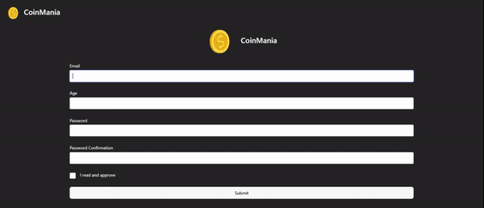

# mvc-coinapp

# MVC
- To lay the foundation for using Model View Controllers in our React apps(https://legacy.reactjs.org/blog/2013/06/05/why-react.html)

# Libraries
- react-router-dom
- axios
- formik
- yup
- millify
- uuid
- bootstrap (cdn)